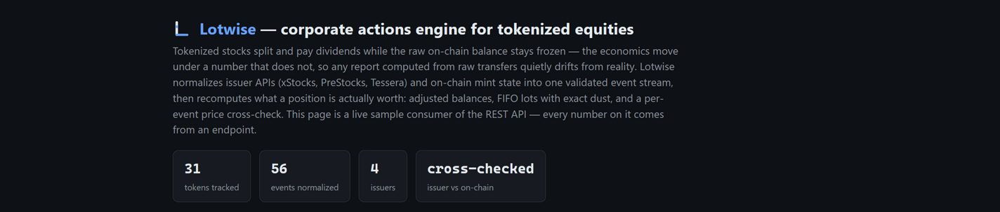
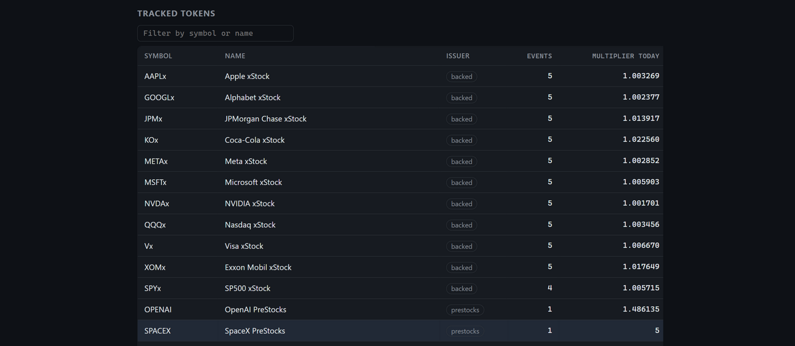
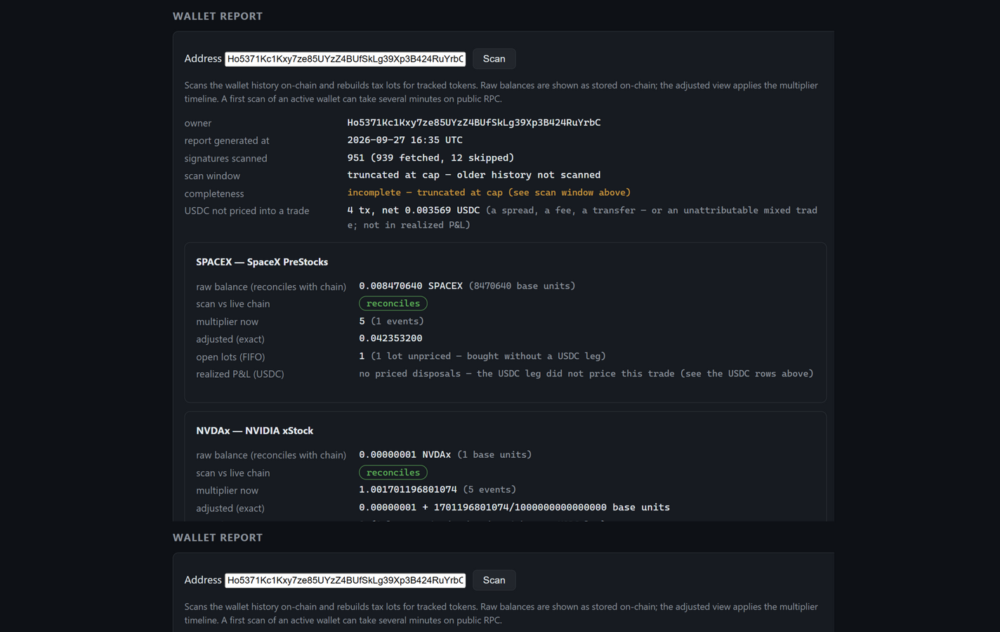
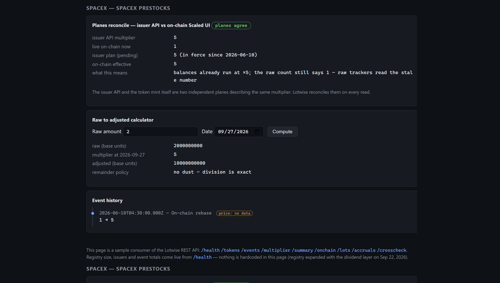
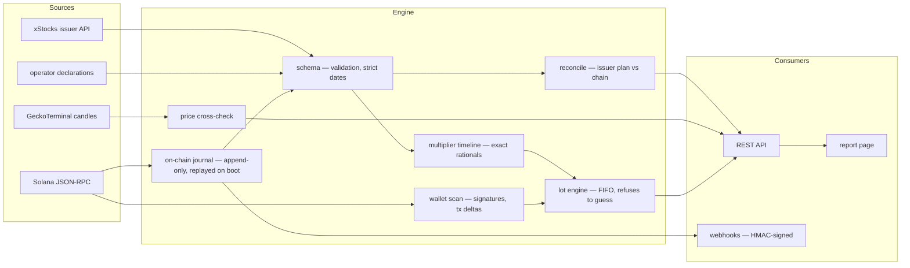

#  Lotwise

[](https://github.com/PLNB1038/lotwise/actions/workflows/tests.yml)


A corporate actions engine for tokenized equities on Solana. Lotwise normalizes splits, dividends, mergers, ticker changes and multiplier rebases across xStocks, PreStocks, Backpack and Tessera tokens into adjusted tax lots, and serves them over a REST API with a self-hosted report page.



## Problem

Tokenized equity issuers rebase positions when corporate actions happen. In the xStocks model the raw balance never changes: a supply multiplier (Token-2022 `scaledUiAmountConfig`) scales the displayed quantity instead. Other issuers rotate mints outright. The event data behind these rebases lives in issuer APIs and, for some issuers, only in on-chain mint state. There is no normalized, queryable source of corporate actions for tokenized equities. Portfolio trackers do not model them at all, and generic crypto tax services treat every mint as an ordinary token with no concept of a split, dividend accrual, merger or ticker change.

The result is silent breakage. Cost basis and P&L computed from raw transaction history are wrong after the first split or dividend. A ticker change orphans the old symbol. A mint rotation makes a wallet look like it sold the entire position at a nonsensical price. Nothing in standard tooling flags any of this, so the numbers stay wrong until a human notices.

Lotwise closes that gap with one canonical event stream, verified against the chain, and tax lots adjusted from it.

## What it does

- **Token registry**: 31 tokenized equities from 4 issuers (xStocks/Backed 16, PreStocks 8, Backpack 4, Tessera 3). Token-2022 mints — decimals per issuer family: 8 (xStocks), 6 (Backpack), 9 (PreStocks/Tessera) — every mint and its decimals verified against mainnet.
- **Canonical events**: one schema, 6 event types (`SPLIT`, `DIVIDEND_ACCRUAL`, `MERGER`, `TICKER_CHANGE`, `REDEEM`, `MULTIPLIER_CHANGE`). Strict validation: canonical ISO-8601 dates, exact decimal multipliers as strings (no floats), mandatory source references. All six are schema-validated and engine-ready; today's live feed produces `MULTIPLIER_CHANGE` (xStocks issuer history and the on-chain journal) — the rest appear the moment an issuer or operator supplies them. Events apply in a canonical order — chronologically by day, and within a day `SPLIT`, then `DIVIDEND_ACCRUAL`, then `MERGER`, then `REDEEM` — so the same facts in any feed order produce the same report. A dividend declared for a merger's new mint on the merger day accrues nothing (the holders are still on the old mint when it applies) — the engine reports that as an explicit warning instead of a silent zero.
- **Event sources**: the xStocks issuer API (paginated history with a completeness check: the oldest node must start at multiplier `1`), and for PreStocks/Backpack the mint state itself, read via an on-chain journal that backfills and diffs across restarts.
- **Adjusted lots**: FIFO lots rebuilt from wallet history and adjusted through the multiplier timeline, with exact dust arithmetic (BigInt rationals; `sampleScaledQty` reports the exact remainder). Swaps against a **USDC leg carry their cost basis**: a lot bought against USDC knows its `basisRaw`, a disposal against USDC books `proceedsRaw` and `pnlRaw` per FIFO piece (basis transfers proportionally with exact trunc-remainder accounting). A trade without a USDC leg — a transfer, a token→token swap, several tracked tokens inside one tx — is flagged `basisKnown: false` / `proceedsKnown: false`, never an invented number.
- **Price cross-check**: daily GeckoTerminal candles around event dates, per-event verdicts (`consistent` / `mismatch` / `suspicious` / `inconclusive` / `no-price-data`).
- **Fail-closed reconcile**: issuer-reported multiplier vs live on-chain Scaled UI amount. An unavailable source is a `503`, never a fabricated value; tokens with a broken multiplier history are excluded from reporting and flagged with a reason, not silently shown as `1`.
- **Report page and REST API**: the page at `/` is a working sample consumer of the API. Zero runtime dependencies (`node:http` and the standard library only).





## Quickstart

Requires Node 24+. There is no install step; there are no runtime dependencies.

```sh
node scripts/serve.mjs
```

Then open http://127.0.0.1:8787/ .

On startup the server loads the registry, reads mint state for every non-xStocks token, pulls xStocks multiplier history, and only then starts listening. Unavailable sources are skipped with a warning instead of crashing the boot; the state of every source is visible at `/health`. The first `/lots` on the default public RPC can hit a relayed upstream rate limit (`503 {"kind":"rate-limit"}` — the endpoint relays the upstream `429`): that is Solana's public quota talking, not a server fault — `--rpc` with your own endpoint removes it.

Flags: `--port 8787`, `--host 127.0.0.1`, `--rpc https://api.mainnet-beta.solana.com` (any Solana JSON-RPC endpoint), `--max-txs 300` (signature cap **per source** — the owner address and each token account — for wallet scans). The port is probed for availability and the host is resolved before boot spends any RPC quota. `--rpc` and `--demo` refuse each other at startup (exit 1): the demo boot has no network, so a launch line carrying both is a contradiction, not a configuration. `-h`/`--help` prints the full grammar.

`--demo` boots offline in milliseconds: a static demonstration set (fictional `DEMOx`/`DEMO2x` tokens, sources marked `lotwise-demo-snapshot`) serves **all six event types** — see the whole schema without waiting for live issuers. `/health` marks the mode with `demo: { snapshotAsOf, snapshotAgeDays }`: the snapshot is frozen at 2026-09-27 and the age tells how far the story is behind today, so a stale-looking demo identifies itself instead of passing for fresh. Without the flag the live boot is unchanged.

```sh
node scripts/serve.mjs --demo   # then: curl "http://127.0.0.1:8787/events?symbol=DEMOx"
```

## 30-second tour

The demo runs on live mainnet — read-only, no wallet scans, safe to curl:

```sh
# Pulse: 31 tokens, event counts, journal and registry integrity flags
curl https://lotwise.tail88c821.ts.net/health

# The SPACEX rebase, straight from the mint: multiplier 1 → 5,
# sourced from the on-chain scaledUiAmountConfig — verifiable in any explorer
curl "https://lotwise.tail88c821.ts.net/events?symbol=SPACEX"

# The same rebase, reconciled: issuer plan vs live on-chain state — verdict: "ok"
curl "https://lotwise.tail88c821.ts.net/onchain?symbol=SPACEX"

# The whole registry: per-token event counts and current multipliers (SPACEX "5", OPENAI "1.4861347")
curl https://lotwise.tail88c821.ts.net/summary
```

Compose the numbers into your own — one fetch, exact integer math, no SDK:

```js
const API = "https://lotwise.tail88c821.ts.net";
const { multiplier } = await (await fetch(
  `${API}/multiplier?symbol=SPACEX&date=2026-07-01`)).json();
const raw = 200000000n;                       // on-chain amount of any wallet, 8 decimals
const adjusted = raw * BigInt(multiplier);    // 1000000000n — exactly 10 shares, zero floats
```



## API

GET (and HEAD) only. Token endpoints accept `?mint=` or `?symbol=` and return `400` for anything outside the registry instead of returning empty data. A tracked `mint` wins over `symbol`; a `mint` outside the registry falls back to the symbol match — a typo in `mint` is not detected, check the spelling. Dates are strict ISO-8601: `2026-02-30` is rejected, not rolled over to March.

| Endpoint | Purpose |
|---|---|
| `/summary` | All tracked tokens with event counts and current multipliers |
| `/tokens?issuer=` | Registry listing, optional issuer filter (`backed`, `prestocks`, `backpack`, `tessera`) |
| `/events?symbol=&type=` | Canonical events for one token, optional type filter |
| `/multiplier?symbol=&date=&raw=` | Multiplier at a date plus a raw-to-adjusted sample with exact dust |
| `/onchain?symbol=&date=` | Issuer-reported vs on-chain multiplier reconcile verdict |
| `/lots?address=` | Wallet report: FIFO lots with cost basis, raw vs adjusted balances, realized P&L from USDC legs. One scan runs at a time — a concurrent scan answers `503` with `kind: "scan-busy"` and `Retry-After` — and the endpoint is GET-only: a HEAD probe answers `405` without running a scan. `moneyOnly` (USDC the pricing did not consume) and the window's economic-result formula: full semantics in [docs/API_SEMANTICS.md](docs/API_SEMANTICS.md) |
| `/accruals?symbol=&address=` | Dividend accruals of one token for one wallet: the base is the position held **at the start of the ex-date**, replayed from the scan window, with honest `baseIncomplete` flags and `totalRaw: null` where the window cannot answer. GET-only like `/lots`; a `200 []` is "no dividends" or a down declarations channel — the separator is the `X-Declarations-Unavailable: 1` response header. Dividend identity, the declarations file and the `supersedes` correction contract: full semantics in [docs/API_SEMANTICS.md](docs/API_SEMANTICS.md) |
| `/crosscheck?symbol=` | Price cross-check verdicts per event (its `ratio` is the one non-string decimal — a float) |
| `/health` | Event/token counts, journal and registry integrity flags, excluded tokens, declarations channel state (`ok`, `loaded`, `superseded`, `decimalsDrift` — a declaration `decimals` disagreeing with the registry, one entry per drifted pair; an empty array means no drift) |

Examples:

```sh
# Health: token and event counts, journal/replay state, excluded tokens with reasons
curl http://127.0.0.1:8787/health

# Events for SPYx
curl "http://127.0.0.1:8787/events?symbol=SPYx"

# Multiplier for SPYx on a date, with a raw-to-adjusted sample.
# raw=100000000 means one whole token at 8 decimals; the response reports exact dust.
curl "http://127.0.0.1:8787/multiplier?symbol=SPYx&date=2026-07-01&raw=100000000"

# Reconcile issuer plan vs live on-chain Scaled UI amount for SPACEX
curl "http://127.0.0.1:8787/onchain?symbol=SPACEX"

# Wallet report: FIFO lots, raw vs adjusted balances, scan completeness
curl "http://127.0.0.1:8787/lots?address=$WALLET_ADDRESS"

# Price cross-check: daily candles vs event dates for OPENAI
curl "http://127.0.0.1:8787/crosscheck?symbol=OPENAI"
```

### Response and error contract

Every response is JSON; decimal quantities are strings everywhere (including `amountPerUnitRaw` in `/events`); `/events` rows are chronological. Errors are `{"error": string, "kind"?: string}` — `kind` is the retry policy: transient (`rate-limit`, `network`, `scan-busy`, `aborted`) means back off and retry; everything else is the upstream refusing or sending garbage, answered `503` without fabricating data. A `400` is the request itself being wrong and fails identically on every retry. Full contract — both rate-limit shapes, the kind catalog, HEAD rules, rate buckets and their env knobs: **docs/ERRORS.md**.

Response shape (a real `/events` row, truncated):

```json
{"type":"MULTIPLIER_CHANGE","effectiveDate":"2026-02-02T21:47:00.000Z","status":"confirmed",
 "sources":["https://api.xstocks.fi/api/v2/public/assets/JPMx/multiplier/history?network=Ethereum#node:…"],
 "multiplierFrom":"1.0040015369331659","multiplierTo":"1.0071547908304908","reason":"Dividend",
 "mint":"XsMAqkcKsUewDrzVkait4e5u4y8REgtyS7jWgCpLV2C"}
```

Wallet scans (`/lots`, `/accruals`) walk full transaction history synchronously — an active wallet can take minutes. The report says so instead of hiding it: `complete: false`, per-token `gaps`, and `truncated` when the signature cap or a stuck page cut the walk short. Pricing is honest about what it knows: realized rows carry `basisRaw` / `proceedsRaw` / `pnlRaw` only when the trade had a USDC leg; the rest are marked unpriced, and a gap piece books its own proceeds share with an unknown basis. `proceedsRaw` is the transaction's NET USDC delta: an unrelated USDC outgoing in the same tx reduces it — reconcile against the `moneyOnly` rows before reading it as a sale price.

Rate limits, per client IP: 12 wallet scans/min, 60 on-chain/price calls/min (see docs/ERRORS.md for buckets and env knobs). Token endpoints and `/accruals` accept both `mint` and `symbol` — when both are passed, `mint` wins. `/onchain` verdicts are `ok | planes-disagree` — the verdict compares the issuer plan (`api`, evaluated at the requested date) against `onChainEffective` (the mint's current `active` multiplier with an already-activated `pending` applied); the raw `active` value may legitimately differ from `api` when a pending rebase sits in between. `/crosscheck` verdicts are the five values listed above.

### Webhooks

The API is read-only; deliveries are initiated by an operator or cron through the CLI (`node scripts/webhook-deliver.mjs`), not by the server. Subscriptions live in `data/webhooks.json`; deliveries are signed (`X-Lotwise-Signature` HMAC-SHA256 over the exact body) with a deterministic delivery id for receiver-side dedupe; the SSRF denylist refuses non-public addresses. Full contract — subscription shape, exit codes, retry policy: **docs/WEBHOOKS.md**.

## Architecture



`scripts/serve.mjs` wires everything together: registry, then events from both source families, then the API server. Modules under `src/`:

- `registry/` token registry (`data/tokens.json`). Corrupt file is an explicit state: the evidence is preserved next to the original, boot continues on an empty registry, corruption is flagged in `/health`.
- `schema/` canonical event validation and a strict ISO-8601 date parser shared by every layer.
- `events/` normalization from xStocks history and on-chain mint state; the on-chain journal (backfill, replay across restarts, read-only mode when evidence preservation fails); the price cross-check.
- `issuer/` xStocks API client and the Token-2022 `scaledUiAmountConfig` parser.
- `ingest/` JSON-RPC client, signature listing, transaction parsing.
- `lots/` multiplier timeline (exact rational arithmetic) and the lot engine. A `MERGER` without an exchange ratio is stored as an informational event but refused by the lot engine: it will not guess.
- `price/` GeckoTerminal client (pool discovery, daily OHLCV), pool orientation handled explicitly.
- `reconcile/` issuer vs on-chain multiplier verdicts.
- `wallet/` wallet history scan and FIFO lot report. Scan gaps are surfaced honestly (`complete: false`), never hidden.
- `api/` REST server on `node:http`. Bad timeline data excludes a token from reporting with a recorded reason instead of killing the process.
- `ui/` the report page.
- `webhooks/` subscription store and HMAC-SHA256 signed deliveries with retries (`scripts/webhook-deliver.mjs` CLI).
- `fs/` atomic file writes.
- `cli/` the serve flag grammar: `--flag value` and `--flag=value` forms, malformed values rejected before any I/O, and the host is resolved and the port probed before boot starts spending RPC quota.

Live on-chain findings observed during development: SPACEX multiplier `1` → `5` effective 2026-06-10, OPENAI `1` → `1.4861347` effective 2026-07-17. Tessera tokens have no rebase mechanism; their multiplier is `1`, and the API says so plainly.

## Testing

```sh
node --test test/*.test.mjs
```

934 tests, all green (plain `node:test`; no mocks for the core paths — the lot engine, timeline and reconcile are tested as pure functions on real-shaped data).

## Status

Built for the Colosseum Crypto World's Fair hackathon (Solana track), September 14 to October 12, 2026.

Lotwise is read-only infrastructure. It writes nothing to mainnet, ships no SPL programs of its own, introduces no new token and no protocol for users to opt into. The only mutable state is local data files under `data/`, which are rebuilt from chain and issuer APIs on boot.

## License

MIT — see [LICENSE](LICENSE).
